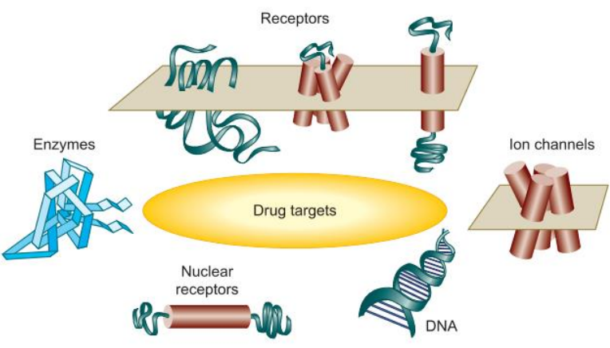

::: details <b class="highlight--2">Mục tiêu học tập</b>

1. Biết được khái niệm về Dược lý học trong y khoa
2. Hiểu được các khái niệm về thuốc: định nghĩa, danh pháp, nguồn gốc, bản chất hóa học, thuộc tính cơ bản, các giai đoạn thử nghiệm lâm sàng của thuốc mới
3. Xác định được các dạng bào chế chính của thuốc: ý nghĩa và nguyên tắc sử dụng.
4. Trình bày được khái niệm về tương quan các yếu tố di truyền và dược lý học y khoa.
5. Trình bày được các khái niệm về vấn đề cá nhân hóa trị liệu trong y khoa.
6. Hiểu được nguyên tắc kê toa thuốc.
:::

## Định nghĩa - những khái niệm cơ bản về dược lý học

Dược lý học là môn học về các thuốc và tác động của chúng lên cơ thể sống.
Dược lý học là môn khoa học nền tảng cho nền y học hiện đại với những thành công đã được chứng minh trong điều trị bệnh và kéo dài tuổi thọ.

Pharmacology ( Dược lý học): là môn khoa học nghiên cứu tác động của thuốc lên cơ thể.
Drug Formulary ( Dược thư): Toàn bộ các loại thuốc được phép lưu hành ở một quốc gia và hường dẫn sử dụng thuốc.
Pharmacopeias ( Dược điển).
 Medication ( Thuốc): là một chất được sử dụng trong chẩn đoán, điều trị, giảm nhẹ hay phòng bệnh.
Prescription ( Kê toa): Hướng dẫn bằng cách viết về thuốc và cách sử dụng.

The therapeutic effect ( tác dụng điều trị): là tác dụng chính của thuốc khi thuốc đó được kê toa.
 Side effect ( tác dụng phụ): Tác dụng không mong muốn của thuốc.
Drug toxicity (Độc tính thuốc): Tác dụng gây hại của thuốc trên cơ quan hay mô cơ thể, thường do quá liều thuốc.
Drug allergy ( Dị ứng thuốc): là phản ứng miễn dịch với thuốc.

Drug interaction ( Tương tác thuốc): xảy ra khi sử dụng một thuốc trước hay sau một thuốc khác và làm thay đổi tác dụng của 1 hay cả 2 thuốc.
Drug misuse (Lạm dụng thuốc):  Sử dụng không thích hợp những thuốc thông thường dẫn đến ngộ độc cấp tính và mãn tính ; ví dụ như thuốc nhuận tràng, thuốc kháng acid và vitamin…

Drug abuse ( Nghiện thuốc): là sử dụng một lượng chất  không phù hợp liên tục hoặc định kỳ.
Drug dependence ( Lệ thuộc thuốc): sự phụ thuộc của một người cần uống thuốc hay chất
Có hai loại lệ thuộc:

1. Lệ thuộc thuốc về khía cạnh tâm lý
2. Lệ thuộc thuốc về khía cạnh sinh lý

Physiological dependence ( Lệ thuộc thuốc về khía cạnh sinh lý): do sự thay đổi sinh hóa trong các mô cơ thể, các mô cần các chất này cho hoạt động bình thường của nó
Psychological dependence ( Lệ thuộc thuốc về khía cạnh tâm lý):là sự phụ thuộc cảm xúc vào một loại thuốc để duy trì một nhu cầu về cảm giác thỏa mãn

– Drug habituation ( Quen thuốc): là dạng nhẹ của lệ thuộc thuốc về tâm lý.
– Illicit drug ( Thuốc cấm sử dụng, thuốc lậu).

Pharmacokinetics: ( Dược động học) là tác động của cơ thể lên thuốc.
Pharmacodynamics ( Dược lực học): là tác động của thuốc lên cơ thể.
Pharmacotherapeutics: sử dụng thuốc trên lâm
sàng.(the study of the therapeutic  uses and effects of drugs)
Pharmacognosy: Nghiên cứu về thuốc có nguồn gốc từ tự nhiên ( cây, động vật).

Tên thuốc:

* The generic name ( Tên chung, tên thuốc sau khi thuốc brand name  hết bản quyền): is given for the drug to being official name.
* The official name (Tên gốc, tên chính thức, tên chung quốc tế, tên hoạt chất):  is the name under which its listed in one in the official publication.
* The chemical name (Tên hoá học): là tên mà các nhà hoá học biết về thuốc đó.
* The trade mark or brand name ( Tên thuốc độc quyền, tên thương mại) (proprietary name) : là tên thuốc do nhà sản xuất đặt ra.

## Lịch sử và vai trò của dược lý học

Từ xa xưa, loài người đã biết sử dụng các chất từ cây cỏ, động vật và chất khoáng trong điều trị giảm đau và chữa bệnh. Chọn lựa các thuốc trong điều trị chủ yếu dựa theo kinh nghiệm hay mê tín.
Dược lý học chỉ mới phát triển được khoảng 150 năm, mở đầu cho sự chiết xuất thành công các thành phần của thuốc.

Nhìn chung dược lý học trãi qua 3 thời kỳ:

* Thời kỳ 1: Các thuốc có nguồn gốc từ động vật và thực vật không gây độc nhằm loại bỏ khỏi cơ thể những vật hay linh hồn gây bệnh.
* Thời kỳ 2: Qua kinh nghiệm, các thầy thuốc đã hiểu biết được các chất thực sự có hiệu quả trong điều trị một số bệnh lý riêng biệt. Từ năm 2100 trước Công nguyên, các thầy thuốc cổ đại đã kê toa có thuốc bôi chứa chất thuốc từ cỏ xạ hương. Năm 1500 trước Công nguyên, những thầy thuốc người Ai Cập cổ đại đã kê toa thuốc có thuốc bôi chứa tinh dầu hương hải ly, thuốc phiện; cùng thời điểm này những thầy thuốc người Trung Quốc cũng đã kê toa thuốc với những thảo dược trong điều trị bệnh
* Thời kỳ 3: Với sự phát triển của ngành Hóa học và Sinh lý học đã giúp cho Dược lý học trở thành một ngành khoa học mới với những bước tiến vượt bậc. Cùng với hiểu biết về cơ chế bệnh sinh đã giúp cho dược lý học có cơ sở khoa học cho việc sử dụng thuốc và hiểu được tác động sinh lý và ảnh hưởng của thuốc trên cơ thể sống.
Đến năm 1804, morphin được chiết xuất ra từ cây thuốc phiện và sau đó là các chất thuốc khác được chiết xuất thành công từ các cây thuốc đã mở ra một bước tiến mới trong ngành dược lý học.

Thế kỷ XX, đặc biệt trong hơn 50 năm qua, phát triển:

* Chiết xuất thành công insulin.
* Phát minh ra thuốc kháng sinh.
* Thuốc chống ung thư
* Những tiến bộ gần đây về sinh học phân tử, di truyền học, và phát minh về thuốc sẽ tạo ra những bước ngoặt mới trong điều trị bệnh ở thế kỷ này.II. Lịch sử (tt)
John Jacob Abel trở thành cha đẻ của ngành dược lý học Hoa Kỳ khi Ông thành lập Khoa Dược lý học đầu tiên tại Trường Đại học Michigan vào năm 1891

Lược qua các giải Nobel về những phát minh về Dược lý học

* Elie Metchnikoff và Paul Ehrlich (1908): thuốc kháng vi sinh vật đầu tiên.
* Frederich Banting và John Macleod (1923): Phát minh và chiết xuất insulin, sử dụng insulin trong điều trị bệnh lý đái tháo đường.
* Sir Henry Dale và Otto Loewi (1936): Dẫn truyền bằng hóa học của xung động thần kinh.
* Ernst Chain, Sir Alexander Fleming và Sir Howard Florey (1945): Phát minh ra penicillin và hiệu quả điều trị khỏi một số bệnh lý nhiễm trùng.
* Edward Kendall, Tadeus Reichstein và Phillp S. Hench (1950): Hormon vỏ tuyến thượng thận, cấu trúc và tác động sinh học của những hormon này.
* Sir James W. Black, Gertrude B. Elion và George H. Hitchings (1988): Phát hiện thuốc chẹn bêta đầu tiên (propranolol), và nhóm thuốc chống ung thư qua cơ chế ngăn cản tổng hợp acid nucleic.
* Robert F. Furchgott, Louis J. Ignarro, Ferid Murad (1998)  khảo sát lộ trình tín hiệu của phân tử NO
* Arvid Carlsson, Paul Greengard, Eric Kandel (2000): Vai trò của Dopamine trong bệnh tâm thần phân liệt và sự truyền tín hiệu trong hệ thần kinh dẫn đến tăng năng lực kéo dài.

## Phân ngành

Dược lý học được chia thành hai phân ngành chính là dược động học và dược lực học.

Cả 2 lãnh vực này của dược lý học đều lệ thuộc vào sự hoạt động của protein:
 Thụ thể: thụ thể màng bào tương, cổng hấp thu, bơm ion, thụ thể lưu hành (bào tương và dịch nhân), protein cấu trúc như microtubule, men nội bào & ngoại bào (chuyển hoá và thải trừ)

Mục tiêu của thuốc:

Thụ thể xuyên màng
Thụ thể trong bào tương (ví dụ: Các hormone có bản chất là steroid)

BẢN CHẤT CỦA LỘ TRÌNH TÍN HIỆU ĐÁP ỨNG SAU THỤ THỂ: Dòng thác tín hiệu

Thụ thể tác động tùy thuộc vị trí biểu hiện
Thụ thể hoạt động ở mức độ phân tử luôn bất biến
Tác động tuỳ thuộc vị trí biểu hiện

## Tương quan các yếu tố di truyền và dược lý học y khoa

PROTEINS:  sản phẩm của sự biểu hiện gene.
Dược lý di truyền học (Pharmacogenetics) và Dược lý gen học (Pharmacogenomics): Khảo sát tác động của di truyền lên tác động của thuốc  Vai trò cùa Liệu pháp cá nhân hóa trong điều trị.

## Cá nhân hóa trị liệu trong y khoa

 Mỗi người có kiểu gen, di truyền, môi trường  sống khác nhau  và  những yếu tố này dẫn đến sự khác biệt về biểu hiện lâm sàng của bệnh cũng như cách thức cơ thể họ đáp ứng với thuốc
 Liệu pháp cá nhân hóa trong y khoa  đề cập việc điều trị bệnh cho  từng cá nhân . Nó liên quan đến việc xác định gen, thông tin di truyền, thông tin lâm sàng cho phép dự đoán chính xác về tính nhạy cảm của người bệnh về tình hình tiến triển của bệnh, các giai đoạn bệnh, và đáp ứng với điều trị.

Đáp ứng với liều thấp/liều cao/liều bình thường/thuốc thay thế.

Vai trò của Pharmacogenetics

## Nguồn gốc thuốc

Trước đây:

1. Cây: digitalis, vincristine.
2. Con người và động vật: epinphrine, insulin và adrenocoticotrpoic hormone, máu và các sản phẩm từ máu người.
3. Kim loại: as iron, iodine and zinc
4. Chất hoá học và chất tổng hợp: ví dụ như sodium bicarbonate

Hiện nay, thuốc còn bao gồm….

1. Thuốc phân tử nhỏ (Small molecule drugs)
2. Thuốc mô phỏng sinh học (Biological drugs): A
substance that is made from a living  organism  or its products and is used in the prevention,  diagnosis,  or treatment  of cancer and other diseases. Biological  drugs include  antibodies,  interleukins,  and vaccines.  Also called biologic  agent and biological  agent.,
ví dụ: máu và các sản phẩm từ máu, kháng thể, interleukin, kháng sinh v.v…
3. Tế bào xử lý (Process cell): ví dụ, vaccine
4. Thuốc tạo từ công nghệ tái tổ hợp. Ví dụ: kháng thể đơn dòng, human insulin v.v…

## Các dạng bào chế thuốc- Các đường sử dụng thuốc

### Dạng rắn (solid)

Viên nén (Tablets)
– Viên nén có áo ngoài tan trong ruột (Enteric- coated)
– Viên nén có chất đệm (Buffered)
Viên ngậm dưới lưỡi, viên đặt trong má (Sublingual/ Buccal)
Viên nhai (Chewable)
Viên sủi bọt
Viên nén nhiều lớp

Viên nang
– Viên nang phóng thích liên tục (Sustained-release or SR)
– Viên nang mềm
– Viên nang có áo ngoài tan trong ruột (Enteric- coated)
Thuốc bột (Powder)
Thuốc cao dán (Plaster)
Viên nén có hình viên nang (Caplet)
Viên ngậm
Các dạng thức với sự phóng thích có hiệu chỉnh (Modified release drug products)

### Dạng nửa rắn (semisolid)

Viên nhét hình viên đạn (Suppository)
Thuốc mỡ (Ointments)
Thuốc dạng kem (Creams)
Thuốc dạng thạch (Gels)
Thuốc nước bôi ngoài da (Lotions)
Thuốc dạng hồ (Pastes)
Miếng dán hấp thu qua da (Patches/ Transdermal patches)

### Dạng (dịch) lỏng (liquid)

Dung dịch (Solution)
Si-rô (Syrup)
Huyền dịch (Suspension)
Cồn ngọt (Elixirs)
Thuốc dạng sữa (Emulsion)
Dạng khí dung (Aerosol)

### Các đường sử dụng thuốc

1. Đường tiêu hoá:

*     Dưới lưỡi.
*     Uống.
*     Toạ dược.

2. Đường tiêm chích.

*     Tiêm dưới da.
*     Tiêm tĩnh mạch.
*     Tiêm bắp.
*     Tiêm trong da.
*     Tiêm trong khớp.
*     Tiêm kênh tuỷ.
* Tiêm hậu nhãn cầu

3. Đường ngang qua da. -Thuốc dán.
-Thuốc xịt.
-Thuốc bôi ( Cream)
4. Đường hô hấp.
5. Tại chỗ

### Đường uống

 Ưu điểm:

* Sử dụng thuận lợi nhất.
* Rẻ tiền, an toàn.
* Bệnh nhân tỉnh táo, có thể nuốt được.
* Thuốc đạt hiệu quả
Nhược điểm:
-Không sử dụng được cho BN buồn nôn và nôn.
-Mùi vị thuốc.
* Gây kích thích đường dạ dày – tá tràng.

## Các giai đoạn trong phát minh thuốc

Quá trình phát minh ra thuốc mới có thể kéo dài 7 – 12 năm hay lâu hơn.
FDA: Chấp thuận sử dụng thuốc mới, theo dõi các phản ứng độc, phản ứng phụ các thuốc.

 Phát minh thuốc:
– Pre-FDA phase: Tổng hợp và phát minh ra thành phần thuốc mới, thử nghiệm trên động vật đánh giá hiệu quả tác động thuốc, độc tính và thông tin về dược động.
– FDA phase

Theo FDA, Mục đích các giai đoạn thử nghiệm lâm sàng phát minh thuốc
Pha 1: An toàn và liều lượng thuốc.
Pha 2: Hiệu quả và tác dụng phụ.
Pha 3: Hiệu quả và theo dõi phản ứng phụ. Pha 4: An toàn và hiệu quả.

 Thử nghiệm lâm sàng:  3 giai đoạn
– Giai đoạn I: (An toàn và liều lượng thuốc)
20 đến 100 người tình nguyện khoẻ mạnh để đánh giá dung nạp thuốc tốt không, thuốc tác động trong cơ thể người như thế nào, chọn liều thích hợp
– Giai đoạn II: (Hiệu quả và tác dụng phụ)
Thử nghiệm trên người có bệnh mà thuốc có thể có hiệu quả ( 100 – 200 người) để đánh gia hiệu quả thật sự, xác định tác dụng ngắn hạn
– Giai đoạn III: (Hiệu quả và theo dõi phản ứng phụ) Sử dụng thuốc trên số lượng lớn bệnh nhân (>1000 bệnh nhân), dùng phương pháp mù đôi ở các trung tâm nghiên cứu để cung cấp các thông tin về tác dụng của thuốc. Giai đoạn IV: (An toàn và hiệu quả) Giám sát sau khi đưa ra thị trường (Postmarketing surveillance)
– Tiếp tục quan sát: chú ý đặc biệt đến tác dụng phụ thuốc, độ an toàn và hiệu quả của thuốc. Tiếp tục tìm kiếm các chỉ định mới của thuốc.
 Chuyên viên Y tế: Giúp giám sát thuốc sau khi đưa ra thị trường, báo cáo tác dụng phụ cho FDA

## Nguyên tắc kê toa thuốc

### Đại cương

Đơn thuốc là văn bản của thầy thuốc để qui định chế độ điều trị cho người bệnh và cán bộ dược dựa vào đó để cấp phát thuốc.
Đơn thuốc còn mang tính chất pháp lý
Các cán bộ Y Dược phải hoàn toàn chịu trách nhiệm nếu xảy ra nhầm lẫn, gây tổn hại đến sức khoẻ và tính mạng của người bệnhDo đó, khi kê đơn cần phải
Viết bằng viết mực
Viết rõ ràng, dễ đọc, không viết tắt
Đơn viết sai, phải viết lại đơn khác, không tẩy xóa
Trường hợp sửa chữa bất kỳ nội dung nào phải ký xác nhận bên cạnh

Nhóm thuốc phải kê đơn và bán theo đơn

* Thuốc gây nghiện.
* Thuốc hướng tâm thần
* Thuốc kiểm soát đặc biệt
* Thuốc kháng sinh.
* Thuốc nội tiết ( trừ thuốc tránh thai )
* Thuốc tim mạch.
* Dịch truyền.

Không được kê vào đơn thuốc:

* Các thuốc, chất không nhằm mục đích phòng bệnh, chữa bệnh;
* Các thuốc chưa được phép lưu hành hợp pháp tại Việt Nam.
* Thực phẩm chức năng;
* Mỹ phẩm

### THỦ TỤC HÀNH CHÍNH

 Phần này thường được in sẵn, khi kê đơn, thầy thuốc sẽ điền vào chỗ trống:

1. Tên và địa chỉ của bệnh viện, trạm xá hay phòng y tế, in ở góc trên bên trái của đơn thuốc.
2. Họ và tên người bệnh, tuổi, giới tính (trẻ dưới 72 tháng tuổi: ghi số tháng tuổi và ghi tên bố hoặc mẹ)
3. Địa chỉ người bệnh
4. Cân nặng: nếu có thể ghi được (cần cho trẻ em)
5. Chẩn đoán
6. Ngày tháng kê đơn
7. Họ tên và chức trách chuyên môn của thầy thuốc (y sỹ hay bác sĩ)
 Hai phần 6 và 7 được in ở cuối đơn. Thầy thuốc phải ghi rõ họ tên rồi mới kí tên, đóng dấu của đơn vị Y tế

### Nguyên tắc kê đơn thuốc

Chỉ được kê đơn thuốc sau khi đã có kết quả khám bệnh, chẩn đoán bệnh.
Kê đơn thuốc phù hợp với chẩn đoán bệnh và mức độ bệnh.Việc kê đơn thuốc phải phù hợp với một trong các tài liệu sau đây:
Hướng dẫn chẩn đoán và điều trị của Bộ Y tế hoặc cơ sở khám, chữa bệnh.
Tờ hướng dẫn sử dụng thuốc đi kèm với thuốc đã được phép lưu hành.
Dược thư quốc gia của Việt Nam.

### CÁC LỖI THưỜNG GẶP TRONG KHI KÊ ĐƠN

 Thiếu thông tin về cơ sở khám chữa bệnh.
 Thiếu hoặc sai sót các thông tin về bệnh nhân như: họ, tên, giới, tuổi, địa chỉ của bệnh nhân, số bảo hiểm y tế
 Chẩn đoán bệnh: ghi sai chẩn đoán, viết tắt.
 Thuốc được kê đơn:
 Ghi nhầm tên thuốc
 Thuốc không phù hợp với chẩn đoánCÁC LỖI THưỜNG GẶP TRONG KHI KÊ ĐƠN (tt)
  Không ghi hàm lượng, nồng độ thuốc, số lượng thuốc, liều dùng, cách dùng (đường dùng, thời điểm dùng thuốc)
  Các thuốc có tương tác nghiêm trọng, không được phối hợp
  Kê những thuốc không được phép kê đơn như thực phẩm chức năng, mỹ phẩm, các thuốc không được phép lưu hành tại Việt Nam, các thuốc không nhằm mục đích chữa bệnh
  Thiếu thông tin về thời gian kê đơn thuốc, chữ ký và học tên người kê đơn
  Đối với đơn viết tay còn gặp vấn đề về chữ viết như viết chữ quá nhỏ, không rõ ràng gây khó khăn cho người đọc đơn và có thể gây ra những biến cố nghiêm trọng.
  Đơn tẩy xóa, không ký tên khi sửa nội dung.
  KHÔNG VIẾT TẮT THÀNH PHẦN CỦA ĐƠN THUỐC

### PHẦN CHUYÊN MÔN

Hàm lượng của thuốc:
 Là lượng thuốc nguyên chất có trong một đơn vị thành phần. Hàm lượng  ghi ngay cạnh tên thuốc
 Đơn vị trọng lượng thống nhất là gram (g), miligam (mg),microgam (g hoặc ).
 Đơn vị thể tích là mililit (ml)
Nếu từ 1gam trở lên thì viết là gam (g)
Dưới 1gam thì viết là miligam (mg) Vd:     5 gram viết là 5g
0,2 gam viết là 200 mg
0,4 miligam viết là 400 g PHẦN CHUYÊN MÔN
Tổng liều thuốc:
Là lượng thuốc dùng trong cả đợt điều trị, ghi cùng dòng với tên thuốc
Ví dụ:
Amoxicilin 500 mg - 21 viên Vitamin C 500 mg - 30 viênPHẦN CHUYÊN MÔN
Nhóm thuốc phải đánh số thứ tự ngày dùng thuốc gồm:
Thuốc phóng xạ.
Thuốc gây nghiện.
Thuốc hướng tâm thần.
Thuốc kháng sinh.
Thuốc điều trị lao.
Thuốc corticoid.
