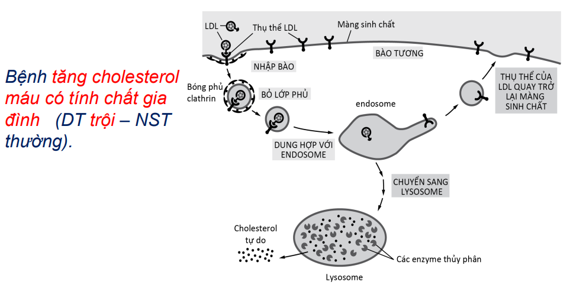

## Các kiểu vận chuyển các phân tử nhỏ qua màng tế bào

```markmap
### Vận chuyển thụ động
#### Khuếch tán đơn thuần
- xuyên màng
- thấm PT nhỏ, ko phân cực <!-- markmap: foldAll -->
    - O<sub>2</sub>
- ít thấm PT  nhỏ, phân cực, không mang điện <!-- markmap: foldAll -->
    - H<sub>2</sub>O, urea, glycerol
- Có thể diễn ra hai chiều
#### Khuếch tán trung gian: thông qua protein kênh
### Vận chuyển chủ động
- Có thể không cần ATP
- Luôn cần protein xuyên màng
```

### Thẩm thấu

```markmap
### Dung dịch nhược trương
- chất tan thấp
- tb ĐV thu nước, phình to
- tb TV sống khoẻ
### Dung dịch đẳng trương
- mmOsmol/L
- tb ĐV sống khoẻ
- tb TV héo rũ
### Dung dịch ưu trương
- chất tan cao
- tb ĐV mất nước dạng răng cưa
- tb TV co nguyên sinh, chết
```

::: info
Xét sự khuếch tán của các chất qua màng trước mới xét đến sự thẩm thấu của nước
:::

::: warning Lưu ý
Luôn có sự trao đổi nước giữa 2 bên màng tế bào. NHƯNG sự thẩm thấu chỉ có được nhờ chênh lệch nồng độ

Có sự thẩm thấu $\Rightarrow$ có sự trao đổi nước nhưng không có chiều ngược lại

~~2 bên màng có ASTT bằng nhau => Không có sự thẩm thấu/khuếch tán các chất tan~~
:::

### Khuếch tán trung gian (Khuếch tán được làm dễ)

Giúp một phân tử qua màng dễ hơn, cơ chế thụ động nhờ protein màng

Cho các phân tử có **kích thước** hay **điện tích** phù hợp qua

```markmap
### Protein kênh
- **kích thước** hay **điện tích** (ion)
#### Aquaporin
- chỉ cho phép H<sub>2</sub>O
- phù não, đái tháo nhạt


### Protein tải (Protein vận chuyển)
- đường, amino acid, nucleoside
- thụ động
- có thể 2 chiều
- liên kết với chất cần vận chuyển
```

### Vận chuyển tích cực

```markmap
### Đặc điểm
#### protein vận chuyển tích cực
#### ngược với gradient điện/hóa
#### Cần năng lượng
 một hướng nhất định tùy tế bào
#### Phân loại
* nguyên phát: thủy phân ATP
* thứ phát: gradient nồng độ ion
```

### Kênh ion

```markmap
### Đặc điểm
* Khuếch tán ion cực kỳ nhanh
* Chỉ theo gradient điện hóa
* Chọn lọc ion (Na<sup>+</sup>, K<sup>+</sup>,...)
* Lâu lâu mở cổng
* Tạo xung thần kih
```

```markmap
### Phân loại
#### cổng điện thế ⚡
#### cổng ligand:
* chất dẫn truyền thần kinh (kênh ion cổng phát),
* ion (kênh cổng ion)
* nucleotide (kênh cổng nucleotide) → kênh mở.
#### cổng áp lực 🐳
* lực cơ học → kênh mở
```

### Điện thế màng

<VidStack
  src="youtube/hrGvIOUkJhU"
  title="Điện thế màng"
/>

Rêcptor Ach là kênh ion cổng phát

kênh ion cổng phát: thông tin -> phát thành dòng điện

Điện thế nghỉ: thấm mạnh vs K+ và thấm

Điện thế nghỉ: kênh không cổng,

thâm mạnh Na+, không thấm với Ca<sup>2+</sup>

## Sự vận chuyển qua trung gian bóng màng

### Xuất bào

Bóng vận chuyển (từ bộ Golgi) chứa các đại phân tử → màng sinh chất → dung hợp màng → phóng thích ra ngoài

](/sinh-xuatbao.png)

### Nhập bào

```markmap
#### Thực bào
- Lớn: vi khuẩn, hạt thức ăn rắn, tế bào nhỏ…
- Chuyên hóa: đại thực bào, BCTT
- Màng sinh chất → chân giả hướng về thức ăn → túi thực bào (phagosome) →....(1).........→ .....(2).....
→ tiêu hóa
- Amib: lấy thức ăn
- Động vật có vú:
Bạch cầu trung tính + đại thực bào: tiêu hủy vi khuẩn + lọai tế bào già chết
```

```markmap
#### Ẩm bào (pinocytosis)
- Nhỏ: các giọt chất lỏng chứa những chất hòa tan
- Động vật nguyên sinh: không phân biệt
- Động vật đa bào: ẩm bào = nhập bào qua trung gian thụ thể.
```

### Nhập bào qua trung gian thụ thể (receptor – mediated endocytosis)



* Gen LDLR (NST 19) → LDL receptor
* Gen APOB (NST 2) → apolipoprotein B-100

### Bóng vận chuyển

Có tính chọn lọc
