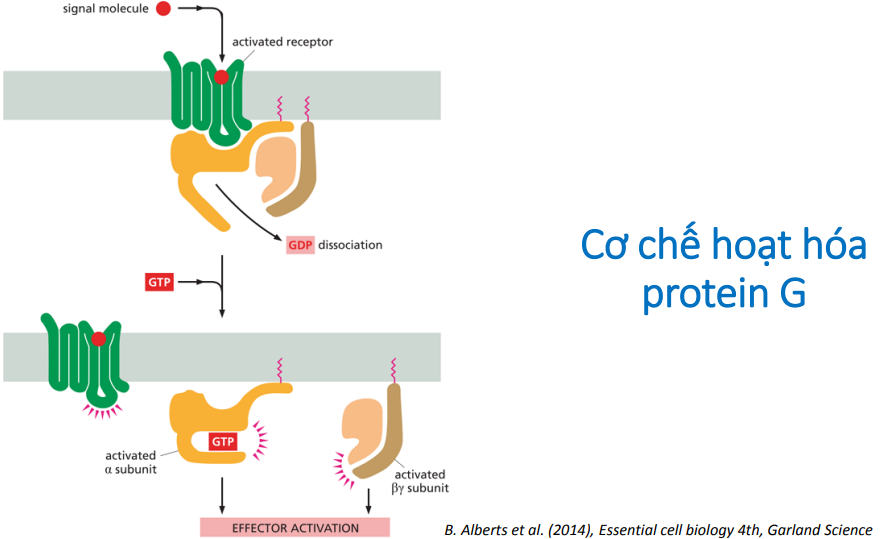
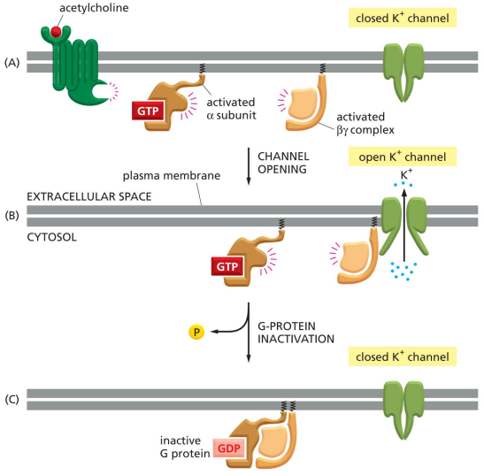
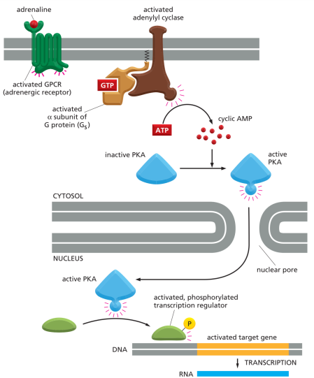
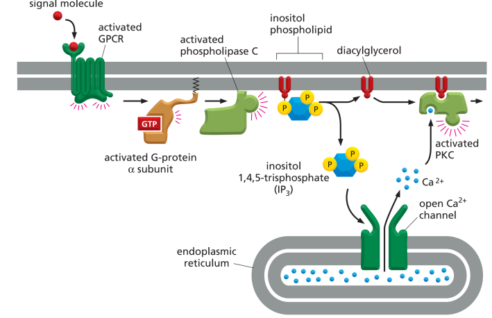
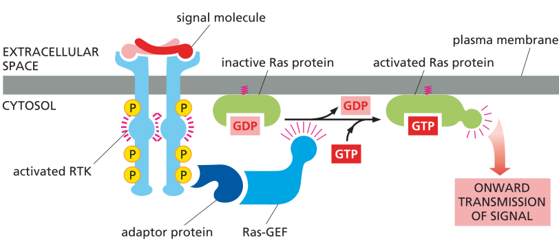
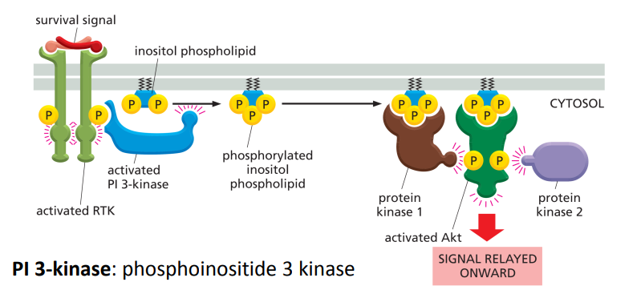

## Các kiểu truyền tín hiệu

```markmap
### Các kiểu truyền tín hiệu
#### Nội tiết
- Hormone: tb tiết → tbào đích
#### Cận tiết
- Khuếch tán dịch ngoại bào
#### Thần kinh
#### Phụ thuộc tiếp xúc
```

```markmap
### Các loại phân tử thông tin
#### Không qua màng
- Lớn/nhỏ mà ưa nước
- Tiết nhận thụ thể
- T.tin thứ 1 → thụ thể  (ngoại)
- Thụ thể → T.tin thứ 2 (nội)
#### Qua màng
- Thụ thể nội bào
- Nhỏ + kị nước
```

## Các giai đoạn truyền tín hiệu

```markmap
### Tiếp nhận (Reception)
- Protein màng (protein kênh)
- Receptor protein nội bào: nhỏ, không phân cực
```

```markmap
### Truyền tin (Transduction)
#### Phosphoryl hoá
- Protein kinase hoạt hoá (gắn ATP)
- Protein phosphatase bất hoạt (loại P)
#### Gắn GTP
- Gắn GTP: hoạt hoá
- Loại P → gắn GDP: bất hoạt
#### Thác tín hiệu
- Khuếch tán theo cấp số nhân
- Thác phosphoryl hoá
```

```markmap
### Đáp ứng (Response)
#### ĐH gen
#### Tổng hợp DNA
#### Chết tế bào
#### Hoạt tính enzyme
#### Tái cấu trúc kh.xương tb
#### Ý nghĩa
- Sống còn
- Nhân đôi
- Biệt hoá
- Chết
```

Đáp ứng với tín hiệu ngoại bào gọi là “đáp ứng xuất”.
Đáp ứng có thể xảy ra trong bào tương hay liên quan đến các hoạt động trong nhân tế bào.

```markmap
### Tương tác đáp ứng
#### Bào tương
- Ptu gây đáp ứng có sẵn
- Nhanh (vài giây - phút)
#### Nhân tế bào
- Điều hoà biểu hiện gen
- Lâu (vài phút - giờ)
```

## Truyền tín hiệu qua thụ thể màng

### Thụ thế - kênh ion

Phân tử gây sự đóng/mở các kênh ion

### Thụ thế - protein G

G – Protein – Coupled Receptor (GPCR)
Ở người có khoảng 700 GPCR.

Protein G gồm 3 tiểu đơn vị: $\alpha, \beta, \gamma$



Chức năng:

* Điều hoà trực tiếp kênh K<sup>+</sup>, mở kênh K<sup>+</sup> => giảm co cơ tim



* Con đường cAMP (nguồn gốc từ ATP - thể hiện năng lượng của tb) - ptu truyền tin thứ 2 (thứ 1: andrenalin)



* Con đường IP

  * IP: inositol phospholipid tách ra thành IP3 và DAG

  * IP<sub>3</sub>: inositol 1,4,5-triphosphate tan trong nước (di chuyển + kích hoạt trong bào tương)

  * DAG: diacylglycerol ( không tan trong nước, kích hoạt protein màng)

  * IP → IP3 + DAG



### Thụ thể - enzyme

Thụ thể màng hoạt động như là enzyme, hay tạo phức với protein khác và phức này hoạt động như là enzyme.

* Thụ thể + tín hiệu → mở phần nội bào của thụ thể hay enzyme liên quan

**Thụ thể gắn enzyme tyrosine kinase**

Receptor tyrosine kinase: RTK

RTK hoạt hóa Ras nhờ Ras-GEF → hoạt hoá MAP kinase



Con đường tín hiệu PI-3-kinase – Akt

RTK hoạt hoá PI-3-kinase – Akt → hoạt hoá IP → hoạt hoá kinase 1 → hoạt hoá Akt



## Truyền tín hiệu qua thụ thể nội bào

* Thụ thể bào tương/nhân → hành vi tế bào/biểu hiện gen

* testostreron, estrogen
