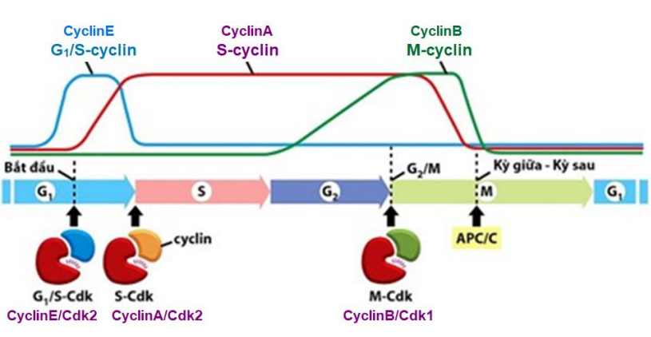
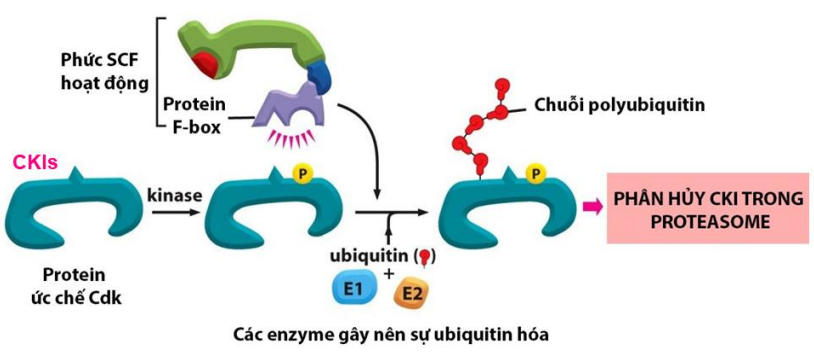
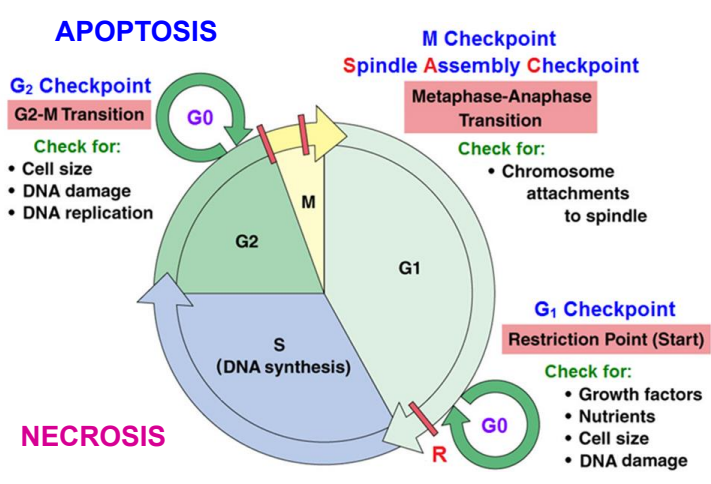
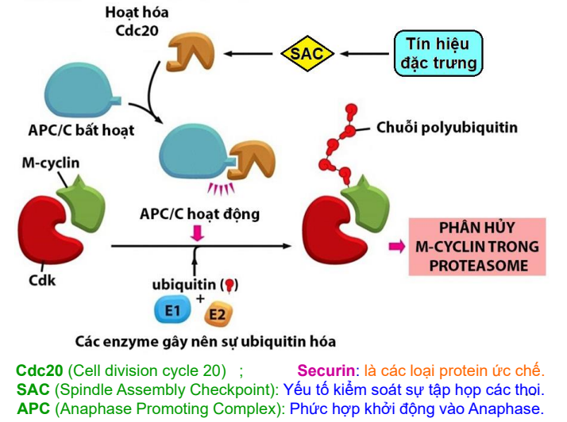
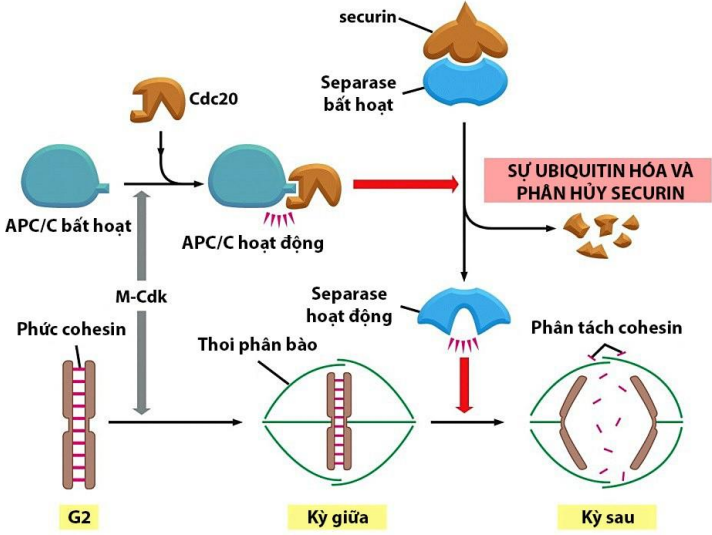

```markmap
1. Phân biệt 3 họ protein trong kiểm soát CKTB.
2. Phân tích cơ chế điều hòa hoạt động của 3 điểm kiểm soát trong CKTB.
3. Phân tích vai trò 3 loại phân tử tín hiệu ngoại bào.
4. Phân biệt 3 loại gen liên quan đến cơ chế phát sinh bệnh ung thư do mất kiểm soát CKTB.
5. Vận dụng kiến thức về gen có liên quan cơ chế phát sinh bệnh ung thư để giải thích vai trò của p53 gây
bệnh ung thư ở người.
```

## CÁC PHÂN TỬ THAM GIA K.SOÁT CKTB

```markmap
### Hai nhóm phân tử nội bào:
#### Nhóm protein thúc đẩy phân bào (giúp tb vượt qua các điểm k.soát), gồm:
- Protein Cdk (Cyclin-dependent kinases)
- Protein Cyclin
#### Nhóm protein ức chế phân bào (làm dừng CKTB): CKIs (CDK inhibitor proteins)
```

### Nhóm protein thúc đẩy phân bào

<p class="highlight--1">Protein Cdk:</p>

* Là các kinase phụ thuộc cyclin. Mỗi Cdk điều hòa hoạt động tại một điểm k.soát khác nhau trong CKTB:
CDK4 ở đầu G~1~; Cdk2 ở cuối G~1~ và đầu S; Cdk1 ở G~2~
* Hàm lượng tương đối cao và ổn định nhưng đều ở dạng bất hoạt
* Đều có hoạt tính kinase, gây phosphoryl hóa, khi l.kết cyclin tương ứng $\to$ P/hợp Cyclin/Cdk h.động

<p class="highlight--2">Protein cyclin:</p>

* 4 loại: G1-cyclin (cyclinD); G1/S-cyclin (cyclinE); S-cyclin (cyclinA) và <span class="highlight--6">M-cyclin</span> (cyclinB),
* Tín hiệu nội - ngoại bào và thời gian của CKTB $\to$ thay đổi nồng độ 3 cyclin (G1/S-cyclin, S-
cyclin và M-cyclin) $\to$ l.kết các Cdk tương ứng $\to$ P/hợp Cyclin/Cdk h.động $\to$ Các protein đích nội bào $\to$ Khởi đầu các gđ
$\to$ Tb vượt qua từng điểm k.soát $\to$ Hoàn tất CKTB.



<p class="highlight--4">Khi tb chuyển sang gđ tiếp theo hoặc đã vượt qua từng điểm k.soát, cyclin nào đã hoạt động trước đó đều bị <span class="highlight-font">thoái hóa bởi các enzyme bào tương</span> </p>

### Nhóm protein gây ức chế, làm dừng CKTB

Ức chế hoạt tính kinase của các Cdk

* Protein ức chế Cdk (CKIs): p16, p19, p21 và p27 * Vai trò: kiểm soát quá trình phân bào và ức chế hiện tượng tăng sinh u $\to$ Duy trì đúng tốc độ phân bào
* Hoạt động: Khi tế bào gặp yếu tố bất lợi, CKIs gắn trực tiếp vào các Cdk $\to$ Cản phức hợp Cyclin/Cdk hình thành $\to$ Dừng diễn tiến CKTB



Khi xong nhiệm vụ, CKIs bị thoái hóa do phức SCF và protein F-box hoạt động (c.đường ubiquitin-proteasome) * Phức hợp SCF chỉ hoạt động khi các CKI đã được gây phosphoryl hóa trước đó.

<p class="highlight--5">Gen p16 (9q21)</p>

Tb bị stress  $\to$ p16 hoạt động $\to$ Không đi vào S, ngược lại.

* ĐBG p16 $\to$ Gen mã hóa Cdk4 hoặc G -cyclin tự khuyếch đại $\to$ Tb tăng sinh quá mức $\to$ U (U nguyên bào Tk, UT da, UT vú)

## CƠ CHẾ PHÂN TỬ TẠI BA ĐIỂM K.SOÁT



### Điểm k.soát cuối G~1~ (điểm R, bắt đầu)

Là điểm k.soát mà tb cam kết không được đảo ngược q.trình phân bào khi đã vượt qua

<p class="highlight--2">Cần phải có: GF - Kích thước đủ lớn - Chất dự trữ - DNA toàn vẹn</p>

Nếu điểm R phát hiện bất thường trong tb $\to$ CKIs hoạt động $\to$ CKTB dừng lại $\to$ G0 (sửa chữa / Apop.)

Cơ chế:

* Khi GF tác động tb ở đầu G  $\to$ <span class="highlight--3">G~1~-cyclin</span> được tạo ra $\to$ Hoạt hoá Cdk4 $\to$ Phức hợp G -Cdk hoạt động $\to$ Tb tổng hợp G /S-cyclin vào cuối G .
* G~1~/S-cyclin hoạt hóa Cdk2 $\to$ Phức hợp G~1~/S-Cdk hoạt động, kết hợp với Cdk4 gây phosphoryl hóa Rb
$\to$ Protein Rb bất hoạt $\to$ Tb vượt qua điểm k.soát cuối G  $\to$ Gđ S (lượng G~1~/S-cyclin giảm nhanh trong S)
* Đầu gđ S, lượng S-cyclin tăng lên và duy trì đến hết KG $\to$ Cdk2 hoạt hóa $\to$ Phức hợp S-Cdk hoạt động

<p class="highlight--1 highlight-font"> ⟹ Khởi động sao chép DNA
(rất cần sự hiện diện của G<sub>1</sub>/S-cyclin và S-cyclin)</p>

### Điểm k.soát G~2~/M

Đảm bảo các yêu cầu ở điểm k.soát cuối G~1~ * các sợi nhiễm sắc phải được sao chép 1 lần và không bị lỗi.

Khi điểm k.soát G~2~/M phát hiện bất thường trên DNA $\to$ CKIs hoạt động $\to$ CKTB cũng bị dừng lại $\to$ G~0~, để: Sửa chữa DNA (lỗi nhỏ) hoặc kích hoạt apoptosis

Vào đầu G~2~, <span class="highlight--6">M-cyclin</span> được tạo ra, bắt đầu tăng cao và tồn tại đến khi tb vào kỳ sau.

* <span class="highlight--6">M-cyclin</span> hoạt hóa Cdk1 $\to$ Phức hợp M-Cdk hoạt động (MPF) $\to$ Tb tổng hợp các protein đích tương ứng với 4 sự kiện:
  * Các gen ngừng phiên mã
  * Vỏ nhân tan rã
  * Thoi phân bào thành lập
  * Co ngắn sợi nhiễm sắc
$\to$ Tb vượt qua điểm k.soát G /M $\to$ Thời kỳ M
2
* Cuối thời kỳ M, <span class="highlight--6">M-cyclin</span> bắt đầu giảm, G -cyclin lại
1
được tổng hợp tăng lên để tiếp tục CKTB tiếp theo.

### Điểm k.soát M (ở cuối KG và đầu KS)

Ngoài M-Cdk, các phức hợp khác cũng xuất hiện ở KG: SAC, APC/C, Cdc20 $\to$ Điều hòa ở điểm k.soát M

Cơ chế:

* Khi OVT tâm động gắn lên tâm động của các NST kép $\to$ Các lực kéo căng (tín hiệu đặc trưng) $\to$ Hoạt hóa SAC $\to$ Kích hoạt Cdc20 $\to$ Cdc20 liên kết APC/C <br>
$\to$ Phức hợp <span class="highlight--7">APC/Cdc20</span> hoạt động, kết hợp M-Cdk
$\to$ Kích hoạt hệ thống <span class="highlight--2">Ubiquitin–proteasome</span> $\to$ Phân hủy <span class="highlight--6">M-cyclin</span> và securin.





## ĐIỀU HOÀ BỞI CÁC YẾU TỐ NGOẠI BÀO

Các nhân tố ngoại bào (chủ yếu là các protein tín hiệu được tiết ra từ các tb lân cận,…).
+ Các nhân tố ngoại bào thường l.kết các thụ thể trên bề mặt tb  Kích hoạt đường truyền tín hiệu nội bào
 Tb tồn tại, phát triển và phân chia hợp lý

```markmap
### 3 loại nhân tố ngoại bào (tích cực)

- Các nhân tố tăng trưởng (Growth factors)
- Các nhân tố sinh tồn (Surviral factors)
- Các nhân tố gây phân bào (Mitogen)

```

### Các nhân tố tăng trưởng kích thích tb phát triển
(tăng kích thước và khối lượng tb)
+ Các nhân tố Gf thúc đẩy tb tăng tổng hợp protein và ức chế các protein và đại phân tử khác phân hủy.
+ Cơ thể muốn phát triển lệ thuộc: sự phát triển và sự phân bào. Nếu: tế bào có phân chia mà không phát triển  Kích thước tb nhỏ lại, khối lượng không tang. + Ở nấm men, sự phát triển và phân bào đều cần chất dinh dưỡng. Ở tb ĐV đều cần tín hiệu từ các tb khác.
