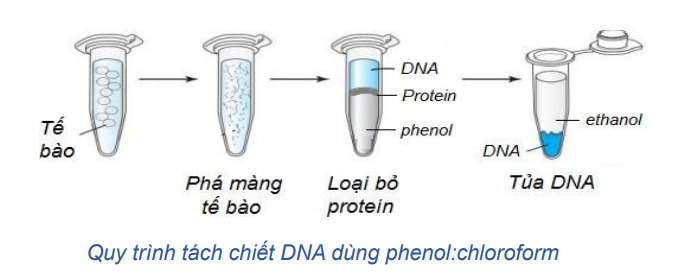

## Tách chiết nucleic acid

| Bước | Hóa chất |
| :--: | :--: |
| Phá màng  | SDS, Protease,… |
| Loại bỏ các thành phần khác (vách, màng, protein, ...) | Phenol:Chloroform |
| Kết tủa DNA/RNA | Ethanol tuyệt đối, isopropanol,... |
| Bảo quản DNA/RNA | Tris-EDTA |

Định tínhvà định lượng nucleic acid: điện di, đo mật độ quang, siêu ly tâm,sắc ký
