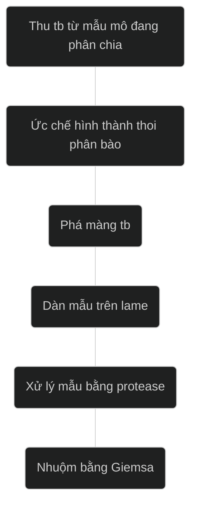

<!-- markmap: foldAll -->

## Nhân tế bào

### Vỏ nhân

```markmap
* Màng ngoài
    * Tiếp nối màng của lưới ER + ribosome.
* Màng trong:
    * Protein → chromatin và lá sợi (lamina) nhân bám vào.
    * Lá sợi nhân: lưới protein lamin của sợi trung gian
```

Phức hợp lỗ nhân giúp vận chuyển hai chiều giữa nhân và bào tương:

* Bào tương → nhân (histone, DNA polymearse, RNA polymerase, protein điều hoà biểu hiện gen và những protein liên quan đến sự hình thành RNA).
* Nhân → bào tương (tRNA, mRNA).

### Hạch nhân

Vùng **tổ chức hạch nhân**: gen mã hoá cho các rRNA 5,8S; 18S và 28S (nhánh ngắn NST tâm đầu 13, 14, 15, 21 và 22) → tiểu phần ribosome

### Chất nhiễm sắc

#### Protein

DNA + histone (2H2A, 2H2B, 2H3 và 2H4)

Protein nonhistone :

* Khung bám cho các DNA → cấu trúc của NST ở kỳ giữa.
* Sự sao chép DNA và điều hoà biểu hiện gen.

#### Đặc điểm cấu trúc trong gian kỳ

Chất nhiễm sắc (sợi chromatin) có đường kính 10nm => Sợi chromatin có đường kính 30nm

| Vùng nguyên nhiễm sắc – euchromatin (đa số) | Vùng dị nhiễm sắc – heterochromatin (10%)|
| :---: | :---:|
| Không đóng xoắn | Đóng xoắn cao |
| Phiên mã chủ động | Phiên mã bị động |
| 10% gen ở được phiên mã | Chứa các trình tự DNA lặp lại cao - có ở vùng tâm và telomere |

#### Đặc điểm cấu trúc khi phân chia

**protein condensin**: Sợi chromatin (30nm) → vòng chromatin (300nm)

→ vòng condensin xếp thành chồng dính nhau và gấp khúc → sợi siêu xoắn có đường kính 700 nm

→ nhiễm sắc thể → NST kép ở kỳ giữa (1400nm) (1 NST kép có 2 tâm động 2 bên)

### Nhiễm sắc thể

* Di truyền tế bào: thực hiện lúc..........
* Phân tích kiểu nhân (Karyotype) : hình dạng, kích thước và số lượng nhiễm sắc thể của một loài.

Band trên NST

* Nhuộm band: R, **G**, Q, C
* Kỳ đầu, kỳ giữa: band sáng tối.
* Băng đậm: vùng dị nhiễm sắc (giàu A,T)
* Băng nhạt: vùng nguyên nhiễm sắc (giàu G,C)

### Kỹ thuật nhuộm băng G



<!-- Metaphase (kỳ giữa), Prometaphase (trước kỳ giữa), Late metaphase (kỳ giữa muộn) -->

## Ti thể (Mitochondria)

```markmap
### Cấu trúc
- Màng kép
    - Màng ngoài
    - Màng trong:
- Phức hợp protein vận chuyển e (I-IV), ATP synthase
```

### Chức năng của ty thể

**Hô hấp tế bào:**

$\ce{C6H12O6 + 6O2 -> 6CO2 + 6H2O + 30ATP}$

* Chu trình Krebs: xảy ra trong chất nền của ti thể
* Sự tạo ATP: phosphoryl hóa ở mức cơ chất + phosphoryl hóa hóa thẩm
    (phosphoryl hóa oxid hóa)
    ATP → cần cho hoạt động sống của tế bào

**Dẫn truyền điện tử:**

FADH2 → 1,5ATP
NADH → 2,5 ATP

$\Rightarrow$ Thu được 32 - 33 ATP

### Sự phân chia của ti thể

### Sự di truyền của ti thể

* Sự phiên mã và dịch mã của mtDNA chịu sự kiểm soát của DNA nhân
* Sự di truyền của ti thể theo dòng mẹ
    37 genes (13 protein, 22 tARN, 2 rARN)

### Bệnh di truyền liên quan đến ti thể

* mtADN bị đột biến → ti thể không tổng hợp đủ năng lượng cần cung cấp cho tế bào → tế bào chết
* mtADN bất thường/ mtADN bình thường khác nhau → mức độ biểu hiện bệnh khác nhau.

Tế bào cơ và não cần nhiều năng lượng → **ẢNH HƯỞNG NHIỀU**

Các bệnh về cơ và thần kinh như: bệnh di truyền thần kinh thị giác Leber (LHON), hội chứng co cơ động kinh (MERRF),…

### Tác dụng của thuốc kháng sinh và tác nhân môi trường đối với ti thể

* Kháng sinh ức chế sự tổng hợp protein của ti thể
  * Dùng chloramphenicol liều cao & nhiều ngày ức chế tạo hồng cầu và bạch cầu ở tủy xương.

Khi cơ thể đói → ti thể thay đổi hình dạng → ti thể nguy cơ bị tan rã

* Trong dung dịch nhược trương → ti thể bị phồng lên
* Trong dung dịch ưu trương → ti thể bị kéo dài ra
* Chất độc, chất phóng xạ → thay đổi hoặc phá hủy cấu trúc và chức năng của ti thể

## Chỗ nối các TB Động vật

<!-- ### Động vật -->

Bộ xương tế bào nối tb -tb và tb-matrix → sức căng cơ học. Chất nền ngoại bào (ECM) chịu sức căng cơ học.

```markmap
- Chỗ neo bám
- Chỗ nối kín
- Chỗ nối qua kênh
- Chỗ nối truyền tín hiệu
```


### Chỗ neo bám

* Tiếp xúc với các sợi **actin/sợi trung gian** (desmosome/hemidesmosome)
* Nối tế bào với tế bào.
* Nối tế bào với ECM

* Ở chuột:  E cadherin bất hoạt → các phôi bào tách rời → phôi không phát triển được


### Chỗ nối kín

### Chỗ nối qua kênh

### Chỗ nối truyền tín hiệu

## Khoảng ngoài tế bào (extracellular matrix - ECM)

### Thành phần

Nguyên bào sợi (fibroblast)

Polysacharide phức:

* Glycosaminoglycan (GAG): Hyaluronan (acid hyaluronuic)
* Proteoglycan (GAG + protein)

Collagen : protein chính của ECM

Fibronectin: glycoprotein

### Vai trò

* Dính các tế bào cạnh nhau.
* Bảo vệ cơ học cho tế bào
* Truyền thông tin giữa môi trường ngoại và nội bào

## Chỗ nối các TB Thực vật

 Cầu liên bào: Chỗ nối trên vách – những lỗ (kênh) xuyên qua vách giữa các tế bào cạnh nhau → Nước và các phân tử nhỏ đi qua.
