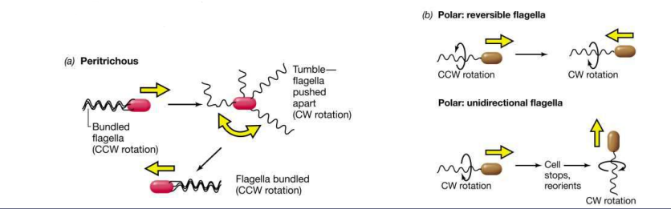
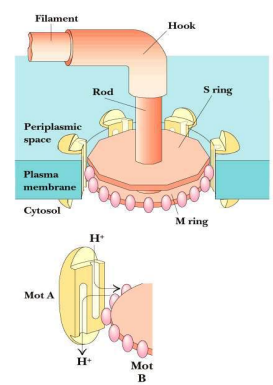
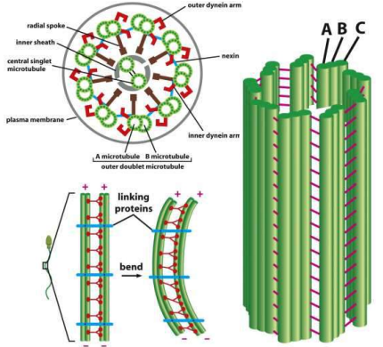

<!-- ## Mục tiêu

1. Phân biệt cấu trúc, chức năng myosin, kinesin, dynein trong các hình thức
   vận động của tế bào
2. Phân tích sự hình thành sự vận động nội tại trong bào tương
3. Phân tích cơ chế vận động của tế bào eukaryote không có lông roi
4. Phân biệt cấu trúc phân tử và cơ chế chuyển động của lông (roi) giữa
   Prokaryote và Eukaryote
5. Phân biệt cấu trúc phân tử và cơ chế co cơ của tế bào cơ xương (cơ vân),
   cơ trơn và cơ tim
6. Áp dụng cơ chế co cơ tim ở mức phân tử để giải thích cơ chế bệnh sinh
   của bệnh cơ tim phì đại -->

## Vị trí & chức năng

```markmap
* Bộ xương tb, cấu trúc lông/roi, tb cơ và cả trên DNA
* Actin: thành viên họ myosin
* Ống vi thể gồm: Kinesin + Dynein
* Tạo lực: ATP → sự thay đổi cấu hình
* Điều hòa sự vận chuyển nội bào của bào quan có màng
* Ba nhóm gồm: myosin, kinesin, dynein
```

```markmap
### Chức năng
* Vận chuyển bào quan: ty thể, golgi, túi tiết
* Dch NST - phân bào
* Co cơ
* Di chuyển tế bào
```

## Protein động cơ trên ống vi thể

### Kinesin

Chức năng

* V/c bóng màng, bào quan có màng, NST dọc OVT
* V/c từ trung tâm tế bào ra tận cùng đầu cộng của OVT
* Hình thành thoi phân bào → phân ly NST
* V/c nhanh ty thể, túi tiết sơ cấp,... của synap đến những tb thần kinh ở xa

:::tip

* Liên quan chủ yếu đến OVT
* (+)
* Vận chuyển bảo quan

:::

### Dynein

Đi về đầu (-) OVT, nhanh hơn Kinesin
2 hoặc 3 chuỗi nặng với domain động cơ
Nhiều chuỗi trung gian và nhẹ biến đổi
Kích thước đầu Dynein > Myosin, Kinesin
Có 2 nhóm chính: Dynein bào tương hoặc Dynein thuộc lông / sợi trục

:::tip

* Nặng
* (-)

:::

#### Dynein bào tương

Homodimer chuỗi nặng với **2 domain động cơ** lớn ở đầu

Vai trò:

* Vận chuyển các bóng màng
* Định vị bộ máy Golgi gần trung tâm tế bào
* Phân ly NST (OVT/OVT sao)

#### Dynein thuộc lông hay sợi trục

Heterodimer với đầu **2/3 vùng domain** động cơ

Vai trò:

* **Sự trượt nhanh** và hiệu quả của các OVT → lông / roi chuyển động
* Cơ chế vận động của lông và roi

Chức năng

* Gây nên sự trượt của các OVT
* Cơ chế vận động của lông và roi

## Sự chuyển động của protein động cơ

Thuỷ phân ATP tạo nguồn NL lớn → protein động cơ khó đảo ngược
tạo hình đi lùi lại → cả chu kỳ protein động cơ chỉ đi theo 1 hướng.

Protein động cơ di chuyển 1 chiều: myosin/sợi actin, kinesin/OVT.


Chu trình: gắn kết → thay đổi hình thể → giải phóng sợi → gắn
kết lại → Pđ/c di chuyển dọc sợi.
▪ Phần đầu Pđ/c xác định loại sợi gắn kết và hướng di chuyển.
▪ Phần đuôi Pđ/c xác định sự nhận diện loại hàng hoá.

Myosin và kinesin khác nhau kích thước và chức năng do:
▪ Vị trí gắn kết với sợi polymer
▪ Sự chuyển đổi lực của vùng domain động cơ
▪ Myosin và kinesin giống nhau vị trí gắn kết ATP.
▪ Myosin, kinesin di chuyển trên 2 loại sợi ≠, lực di chuyển ≠
▪ Myosin và kinesin ≠ trình tự, nhưng có 2 vùng domain động cơ
ở lõi trung tâm → giả thuyết tiến hoá từ nguồn gốc chung

<!-- <tr>
    <td colspan="2">Sum: 28</td>
</tr> -->

## Sự di động của tế bào Vi khuẩn - HP

### Giới thiệu

Bơi đến biểu mô dạ dày

VK di động nhờ roi

VK di động có hướng rất rõ, tập trung (nơi có chất dinh dưỡng…)

Roi VK có loại khác nhau tuỳ từng loài:

* 1 roi / 1 chùm roi / 2 roi mọc ở cực
* Nhiều roi mọc quanh tế bào…

Cấu trúc và cơ chế vận động roi ở VK khác roi ở tb eukaryote.

* Không có cấu trúc OVT 9+2. Chỉ gồm: gốc roi, bản lề, thân roi
* Protein vòng trên màng tb hoạt động chuyển động xoay như vòng bi



Roi hoạt động **xoay ngược chiều kim đồng hồ**, hướng xoay đảo ngược định kỳ gây ra sự đổi hướng di chuyển của VK.

* VK có roi xung quanh, khi roi không tụ lại 1 hướng → VK chuyển động kiểu **nhào lộn**

### Cơ chế

Sự vận động được tạo ra bởi 1 lực proton do dòng ion H  qua màng tb VK.

Vùng gốc roi vận chuyển proton xuyên màng hoạt động và xoay quanh.
Cơ chế chuyển động: xoay vòng ở vùng gốc roi.
▪ Năng lượng: H thấm vào trong tb, bơm proton sử dụng ATP duy trì gradient H+



## Sự di động của tế bào Eukaryote

### Di động kiểu amip:

* TB sống tự do, không màng cứng

* Thuyết sol-gel: nội sinh chất chuyển dạng Sol (lỏng) chảy vào chân giả → chuyển dạng Gel (đặc) → chuyển dạng Sol (lỏng) → tiếp tục chảy vào chân giả mới

* Sol: tiểu phần nhỏ actin phân tán

* Gel: actin liên kết tạo mạng lưới 3 chiều


### Di động có lông roi

Tinh trùng: Roi đập kiểu lượn sóng hình sin → đi ngược dòng ống sinh dục

Động vật nguyên sinh: Lông rung động nhịp nhàng → giúp sinh vật di chuyển

### Cấu trúc lông roi

Thân roi (9+2):
* 9 đôi OVT ngoại vi
* 2 OVT trung tâm

Gốc roi (9+0): không có đôi OVT trung tâm

OVT nối nhau bằng dynein

Cơ chế chuyển động: uốn cong



### Cơ chế vận động

Các OVT nối nhau bằng protein dynein

Các đôi OVT trượt lên – xuống nhờ dynein

Khi có ATP và Ca2+:

→ Trung tâm hoạt tính ATPase của dynein + ATP

→ Thủy phân ATP thành ADP và P để giải phóng NL

→ Các protein dạng cánh tay dynein kẹp và kéo bộ đôi bên cạnh làm cho các bộ đôi trượt lên nhau

Ở roi tinh trùng có protein nối nexin kết nối các bộ đôi OVT, kéo giữ các OVT trượt lên xuống, gây ra sự cong.

Sự trượt theo những hướng đối nghịch nhau sẽ làm lông hay roi cong về phía đối nghịch nhau.

## Sự co cơ của tế bào cơ xương (vân)


Tế bào cơ xương dài, mỏng, lớn chứa nhiều nhân

Nhân nằm phía dưới màng sinh chất

Phần lớn bào tương bên trong được làm bằng các sợi cơ

Đốt cơ gồm một chuỗi dài lặp lại các đơn vị co cơ nhỏ

Gồm sợi mỏng actin và sợi dày myosin xếp song song, chính xác và cài vào nhau một phần tạo dải tối và sáng xen kẽ:
* Dải A: dải tối, vị trí sợi dày myosim
* Dải I: dải sáng, chỉ chứa sợi mỏng actin

### Sợi dày myosin

Gồm nhiều phân tử myosin II hợp lại với đuôi bó sát và đầu đưa ra ngoài
*   Tương tác đuôi – đuôi → tạo cấu trúc lưỡng cực với hàng trăm đầu myosin
*   Đầu myosin gắn kết và thủy phân ATP → di chuyển về đầu (+) sợi actin
▪ Đầu myosin: gắn với actin, ATPase
*   Mỗi phân tử myosin gồm có:
*  2 đầu là 2 chuỗi nhẹ hình cầu
*  đuôi là 2 chuỗi nặng xoắn thành sợi

### Protein phụ trợ

*  Đầu (+) sợi actin gắn vào đĩa Z (Cap Z + α-actinin)
*  Nebulin
*   Là protein khuôn kéo dài từ đĩa Z đến đầu (-) sợi actin
*   Vai trò “Phân tử thước đo” xác định chiều dài sợi mỏng actin
*  Tropomodulin
*   Là protein như mũ chụp, gắn vào đầu (-) sợi actin
*   Vai trò ổn định đầu (-) sợi actin
*  Tinin
*   Protein khuôn đối diện, liên kết chặt myosin, đàn hồi như lò xo
*   Vai trò định vị sợi dày ở giữa các đĩa Z
*  Tropomyosin, troponin
*   Bao bọc sợi actin


### Sợi mỏng actin
* Actin: protein hình cầu, hai chuỗi xoắn
▪ Tropomyosin: gắn dọc rãnh chuỗi xoắn actin
* Troponin:
*  Troponin T: gắn với tropomyosin
*  Troponin I: ngăn cản mối liên kết actin-myosin
*  Troponin C: gắn kết với Ca2+
*   Là một dạng đặc biệt của protein calmodulin
*   Đáp ứng cực nhanh với sự gia tăng nồng độ Ca2+

### Cơ chế co cơ

-  Khi cơ co, đốt cơ ngắn lại do sợi myosin trượt qua sợi actin về hướng đầu cộng (vạch Z)

::: detail Cơ chế đầy đủ

Chu kỳ cầu nối chéo
* Là quá trình co cơ xảy ra khi có sự tương tác phụ thuộc Ca2+ của actin và myosin mang tính chu kỳ.
* Khi có ion Ca2+
→ Ca2+ bám vào troponin C → dịch chuyển tropomyosin → để lộ vị trí liên kết giữa myosin và actin → với hoạt tính ATPase, đầu myosin phân giải ATP → biến đổi hình thái → liên kết với trung tâm actin → làm cơ co
* Khi không có ion Ca2+
→ Ca2+ tách bỏ troponin C → tropomyosin che phủ trung tâm kết hợp của sợi actin → đầu myosin không gắn được với trung tâm actin → cơ duỗi

:::


Các bước tóm lược của chu kỳ cầu nối chéo:

1.  Bước 1: Gắn ATP
2.  Bước 2:  Thủy phân ATP
3. Bước 3: Hình thành cầu nối
4.  Bước 4: Giải phóng Pi
5.  Bước 5: Giải phóng ADP

Khi nồng độ Ca2+ tăng
→ Troponin C gắn với Ca2+
P
→  hóng thích troponin I
→ Tropomyosin trượt trở lại vị trí bình thường
→ Đầu myosin gắn vào được sợi actin
→ Di chuyển dọc theo sợi actin (ATPase)


## Sự co cơ của tế bào cơ trơn

### Cấu tạo

Cơ trơn thành phần cấu tạo của hệ thống mạch máu, các tạng rỗng như dạ dày, ruột, bàng quang, tử cung,...

Tế bào cơ trơn gồm các tấm tế bào hình trục chính rất dài

Mỗi tế bào có một nhân duy nhất.

Tế bào cơ trơn không có troponin

### Cơ chế

Cơ chế co cơ được kích hoạt bởi Ca2+  ở cơ trơn khác cơ xương
*  Ca2+ kích hoạt calmodulin - CaM
→ CaM kéo caldesmon ra khỏi sợi actin
→ Vị trí liên kết với actin được bộc lộ
*  MLCK phosphoryl hóa chuỗi nhẹ myosin
→ Đầu myosin có thể tiếp xúc với sợi actin và gây co cơ
*  Khi đầu myosin được khử phosphoryl hóa
→ Đầu myosin tách khỏi sợi actin và trở nên bất hoạt

### Điều hoà

Adrenaline gắn kết thụ thể protein G
→ Làm tăng nồng độ AMP vòng
→ Hoạt hóa protein kinase phụ thuộc AMP vòng (PKA)
→ Sự phosphoryl hóa PKA + bất hoạt MCLK làm cho tế bào cơ trơn nghỉ ngơi

<!--
cơ co thì đĩa Y thu hẹp lại, các cơ trượt lên nhau, đĩa A bình thường

Troponin I đột biến $\Rightarrow$ dễ nhồi máu cơ tim

Trôpnin T lớn nhất; C: vừa vừa

video troponin -->

Myosin Light Chain (MLC) kinase: phosphoryl hoá ML → ái lực sợi myosin vs actin $\top$ → co cơ (Ca^2+^ hoạt MLC kinase)

Giản cơ: MLC Phosphatase

kênh Ca^2+^ điện thế, kích thích Ca2+ trong Lưới cơ tương (sarcoplasmic reticulum - SR) đi ra ngoài

Agonist là chất đồng vận, hoạt hoá Gq, hoạt hoá IP~3~ kích thích giải phóng Ca2+ trong SR

Ca^2+^ kết hợp với CAM (Calmodulin) thành Ca^2+^ CAM hoạt hoá MLCK hoạt hoá MLC
